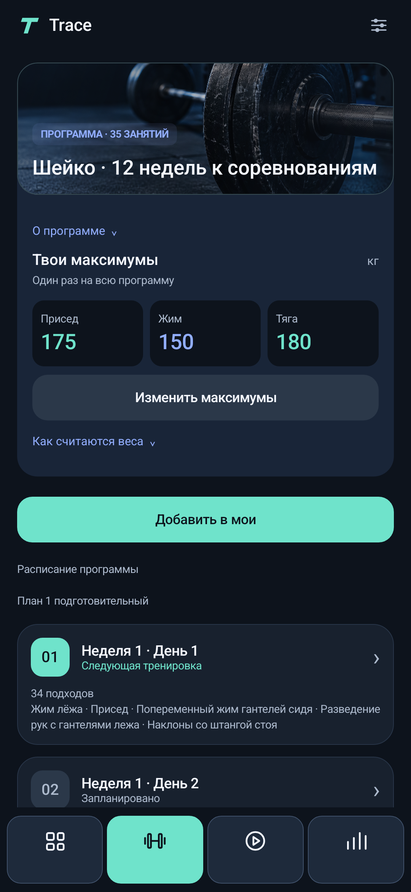
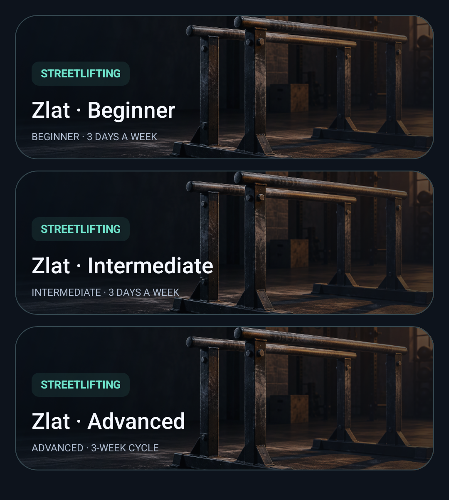

<p align="center">
  
</p>

# Trace

**Your training plan, always within reach.**

Train without opening a spreadsheet. Trace shows your next set, calculates your weights, and keeps your workout history. Log sets in the app or use the workout controls in your phone's system panel.

**Android 8.0+ · English / Russian · No account required · Works offline**

## Download and install

### [Download Trace for Android — APK](https://github.com/david-daveee/Trace/releases/latest/download/Trace.apk)

[All releases and release notes](https://github.com/david-daveee/Trace/releases)

1. Open this page **on your Android phone** and tap **Download Trace for Android**.
2. Open **Trace.apk** from your browser's downloads or your Downloads folder.
3. If Android asks you to allow installation from this source, open the suggested settings and allow it for the browser or file manager you used to open the APK. The exact wording varies by phone.
4. Return to the file, tap **Install**, then **Open**.
5. When you start your first workout, allow notifications to use the system workout controls.

You do not need Android Studio or a computer. An iPhone version is not available yet.

**To switch the app to English:** tap the settings icon at the top and select **English** in the language selector.

## Update Trace

Open **Settings → Trace updates → Check for updates**. Trace checks the public GitHub release, shows its version and release notes, and offers **Download APK** when a newer version is available. Release notes are published in English.

The button opens your browser. Open the downloaded APK and confirm the Android update to keep your existing data. The app never installs an update silently. An internet connection is needed to check; the last successful result and its date remain visible offline.

## Start your first workout

1. Open **Plans**, choose a program, and tap **Add to my plans**.
2. Enter your weights in the program card. Sheiko plans use your **squat, bench press, and deadlift maxes** to calculate percentages. Zlat Beginner uses **added working weight**; Intermediate asks for added-weight one-rep maxes; Advanced also asks for body weight.
3. Open your program in **My plans** and start a workout.
4. Complete a set and mark it done. The next set appears immediately; there is no rest timer.
5. At the end, tap **Save workout**. Your results appear in history and progress, and the next session advances to the next day.

The default maxes in Sheiko plans come from the source spreadsheets. Replace them with your own before starting. For accessory exercises without a prescribed weight, enter your working weight manually.



## Find your way around

| Tab | What you can do |
| --- | --- |
| **Plans** | Filter by Powerlifting, Streetlifting, or your other categories; browse programs, import a file, or create a custom plan. |
| **My plans** | Find your programs, change weights, and continue training. Your most recently used program appears first. |
| **Workout** | Review sets, edit weight and reps, and mark or unmark any set. |
| **Progress** | View your activity calendar, stats, and saved workout history. |
| **Steps** | Track today's steps with your phone's sensor and set a daily goal. |

## Today's steps

Open **Steps → Turn on tracking** and allow physical activity access. Carry your phone with you to record steps, including with the screen off. The daily goal starts at 8,000 and can be changed with **Edit goal**.

The Steps tab and tracking notification also show **estimated distance in kilometers**. Tap **Step length** to adjust the default of 70 cm. Distance is calculated from step count and step length, not GPS. For calibration, divide a known walking distance in centimeters by the number of steps you took.

In **Steps → Steps**, above the tracking controls, the **Your daily rhythm** card shows today's steps and estimated distance, an interactive seven-day chart, and weekly and all-time totals. Tap a bar to view that day's numbers. A dash means no records; walking stays separate from your saved workout calendar. Distance estimates use your current step length.

Tracking begins when you enable it; steps from earlier today cannot be recovered. A quiet notification keeps background tracking visible. After a reboot or force-stop, open Trace again. Android may interrupt background work, so some steps can be missed. A built-in step counter is required; step counting does not use GPS.

Step history, goal, step length, and tracking preference are included in full backups. Android permissions are granted separately on each phone.

### Record a walk

The Steps tab opens the step counter by default. Use the **Steps / Walk** switch at the top to view your route, or swipe left for Walk and right for Steps. Dragging directly on the map pans the map; swipe outside it to change sections. Opening a walk notification goes directly to Walk.

In **Steps**, choose **Walk** using the top switch, then tap **Start walk**, allow precise location, and take your phone outside. The map records your route; **Finish walk** saves its GPS distance and duration. You can also finish from the ongoing notification. Recording continues with the screen off while Android keeps the service running. Trace does not start location recording automatically or track you all day.

Saved walks are listed below the map. To remove one, open its entry, tap **Delete walk**, and confirm. Daily steps, other saved walks, and an ongoing recording are preserved. Previously exported backups keep their own copy. Drag the map, use +/− to zoom, or tap **Fit route**. GPS gaps are displayed as breaks rather than invented paths. Recording stops at 24 hours or 10,000 accepted points. After a force-stop or service interruption, start a new walk; the previous points are retained. GPS recording needs precise location and may not work indoors. The daily distance estimate from steps remains separate from GPS walk distance.

The map uses © OpenStreetMap contributors tiles. Internet is needed for uncached map areas; the map server receives tile-area requests and your IP address. Routes stay on your phone and are included in full backups. Without internet, GPS points can still be recorded and the route line displayed, but some map tiles may be missing. Restoring a backup never starts location recording.

## During your workout

- **Keep controls within reach.** Pull down your phone's system panel to see the current exercise and set actions. Its appearance depends on your Android version and phone software.
- **Fix an accidental tap.** Unmark any set in the Workout tab. Undo removes the most recent completion mark.
- **Update a max once.** Future percentage-based weights update throughout that program. Completed sets keep their recorded weights.
- **Switch programs freely.** Your unfinished session stays paused so you can return to it later.
- **Keep your list tidy.** Use **Remove from my plans** to hide a program from your list. Its history stays, and you can add it again from Plans.

### Barbell loading diagram

When creating or editing an exercise, enable **Barbell exercise · 20 kg bar**. Trace shows a symmetric plate diagram in the plan editor and during that exercise. It uses 1.25, 2.5, 5, 10, and 20 kg plates, assuming enough plates are available. Enter the total weight including the bar: 100 kg means two 20 kg plates on each side.

If the weight cannot be assembled exactly, the diagram shows the closest lower load and a warning. Your recorded set weight is never changed by the calculator. Existing active sessions keep their exercise settings; edits apply to future workouts.

## Included programs

| Program | What's inside |
| --- | --- |
| **Sheiko · Preparation** | A four-week preparation cycle with 16 workouts. |
| **Sheiko · Competition** | Eight weeks of preparation and a four-week competition phase: 35 workouts followed by a competition event. |
| **Zlat · Beginner** | A basic weighted routine from 2018. Next-session increases are calculated after you confirm your results. |

| **Zlat · Intermediate** | Separate volume, technique, and control days. A Trace adaptation with independent progression for volume and heavy work. |
| **Zlat · Advanced** | A three-week cycle with nine sessions. Confirm actual reps and rate heavy or technique blocks before saving. |

Sheiko weights follow the percentages prescribed in each plan. Zlat Beginner uses the last planned set. Intermediate uses confirmed repetitions; Advanced also uses your difficulty rating. All three Zlat plans avoid automatic 0.5 kg increases. Advanced starting loads include half your body weight in the percentage calculation and round down to 1.25 kg. Max attempts are chosen manually; follow the weekdays shown in the plan rather than training nine days in a row.

The Intermediate and Advanced entries are explicitly labelled Trace adaptations of [Mathew Zlat’s guide](https://www.scribd.com/document/654317739/The-complete-guide-to-weighted-calisthenics-1), with their calculation rules explained in the app. Existing workout history, custom plan names, and chosen cover photos are preserved.



## Bring your own plan

Open **Plans** to import a file or choose **Custom plan**.

Trace supports JSON, CSV and XLSX using the in-app template, plus the supported original Sheiko XLS format. You can download the template from the app. Arbitrarily formatted Excel workbooks are not automatically recognized; the 12-week Sheiko cycle is already included separately in the catalog.

### Share a plan

Tap **Share plan** on a card in **Plans**, or open the plan and use the same action. Choose a messaging app, email, or another destination from the Android share sheet. Trace attaches a JSON file with the exercises, weights, cover, and cover framing. Workout history and session progress are excluded.

The recipient taps the attachment and chooses **Trace** in Android’s Open with menu. Trace shows a preview; the plan is added only after confirmation. If the messaging app does not offer Open with, use **Share → Trace**, or save the file and import it through **Plans → From file**. The imported plan starts separately from day one.

### Make a plan yours

Open a plan and select **Change category**. Choose Strength, Streetlifting, Powerlifting, Bodybuilding, Calisthenics, Cardio, or a custom name. Categories are labels: changing one does not alter exercises or weight progression. They travel with shared plans and backups.

Open a plan and tap **Change cover → Choose photo or screenshot**. Pick an image from your phone, including the Screenshots folder. Drag to reposition it, pinch or use the zoom slider, then tap **Save**. To adjust it later, choose **Change cover → Adjust cover**. Cancel leaves your previous cover unchanged. Trace keeps an optimized copy, so the cover stays available after restarting and travels with JSON exports and workout backups. Use **Reset cover** to restore the default image.

To remove a custom or imported plan, tap **Delete plan** in Plans or at the bottom of its detail page and confirm. The plan disappears from both lists. Tap **Undo** above the bottom navigation to restore it, including its unfinished session on pause. Completed workout history stays. Undo also works after restarting Trace and restores deletions in reverse order. Built-in catalog plans remain available; **Remove from my plans** simply hides them from your personal list.

You can also delete an exercise from a day and use **Undo** to return it to its position. Keep at least one exercise per day. Existing workout sessions keep their recorded sets.

## Update Trace

Download the latest **Trace.apk** using the link above and install it **over your current version**. You do not need to uninstall Trace first.

Before updating, save a backup through **Settings → Save backup**. It includes plans, covers and their framing, history, unfinished workouts, recoverable deletions, step history, step goal and length, tracking preference, and language. Settings shows the last successful backup date.

## Frequently asked questions

**Where is my data stored?**  
On your phone. There is no account or cloud sync. To move to another phone, save a backup, transfer the file, and choose **Settings → Restore from file** on the new device. Restoring a full backup replaces its current data after confirmation. Older workout-only backups still work and leave current steps and settings unchanged. Hardware step-counter baselines are reset on restore to avoid counting another device’s lifetime steps.

**Why isn't my workout showing in Progress?**  
The calendar counts saved workouts. After completing all sets, tap **Save workout**.

**How do I change the language?**  
Tap the settings icon at the top and choose English or Russian.

**Why can't I see the workout panel?**  
Start a workout and check that notifications are enabled for Trace in Android settings. If the app was force-stopped, open it again. Lock-screen visibility depends on your phone settings.

**Android says “App not installed.”**  
Check that the download finished and your phone has enough free space. An existing Trace build signed with a different key may prevent the update from installing. Save a backup first; do not uninstall the only copy of your workout history.

## Have an idea or found a problem?

[Open an issue](https://github.com/david-daveee/Trace/issues) with your phone model, Android version, and what happened. A screenshot without personal information can help explain a bug.

<details>
<summary>For developers</summary>

Java 17, Android Views, and Android SDK 35. Minimum Android version: 8.0 (API 26).

Open the project root in Android Studio and wait for Gradle sync. Build and run checks on Windows:

```powershell
./gradlew.bat assembleDebug testDebugUnitTest lintDebug
```

APK output: `app/build/outputs/apk/debug/app-debug.apk`. The downloadable build uses a debug signing key and is distributed through GitHub Releases.

[Implementation details and development notes](docs/DEVELOPMENT.md).

</details>

### Automatic backups
In Settings, select **Automatic backup every 2 weeks** and turn on **Enable**. On Android 10+, Trace automatically creates **Downloads/Trace/Backup** when saving the first copy. Android 8–9 requires choosing a folder once. Trace saves a complete JSON backup there, verifies the written file, and keeps previous copies. A background job checks daily and saves when 14 days have passed since the last successful automatic backup. Android may delay background work; force-stopping Trace pauses it until the app is opened again. Settings show the last automatic backup and any save failure. Use Restore from file to recover a copy. After reinstalling, enable automatic backups again. Existing copies can be restored with the file picker. Previously configured custom folders continue to work until automatic backup is switched off and on.

## Exercise notes and plan editor
Open a plan and choose **Plan editor**. Duplicate days or exercises, rename days, hold the grip to drag exercises, or use the up/down buttons. The −/+ controls adjust sets. Exercise forms edit weight and repetitions while preserving percentage-based calculation when selected. Existing workout sessions and saved history keep their snapshots.

Add **Exercise note** from the editor, a day preview, or your current workout. Notes are shared by exercises with the same name within a plan. They are included in shared plans and backups, and workout history retains its note snapshot.

## Backup history
Open **Settings → Backup history** for dates, file sizes, and Restore buttons. Automatic copies in Downloads/Trace/Backup and the configured custom folder are discovered, and newly saved manual copies are recorded. Restoring uses the existing validation and confirmation before replacing data. Files removed or made inaccessible outside Trace cannot be restored; use **Restore from file** for older manual copies or copies from another device. Android folder permissions are not transferred in a backup.

The built-in 2018 Zlat routine uses a Trace adaptation for gyms without microplates: the final planned set gives +5 kg at 8+ reps, +2.5 kg at 7, +1.25 kg at 6, and no increase at 5 or fewer. The original 0.5 kg increase is disabled. This beginner routine is distinct from Zlat’s three-day intermediate program. Existing saved results are preserved.

## Zlat intermediate adaptation
A separate catalog plan provides volume, light technique, and top-set days. Configure known added-weight 1RMs before starting. This Trace adaptation rounds initial weights down to 1.25 kg and holds weight when the original progression would call for microplates; it runs regular weeks without automatic monthly 1RM tests. Volume and top-set progression are independent and require confirmation of actual reps. Existing beginner plans and history are retained. See the in-app source and rules for details.
